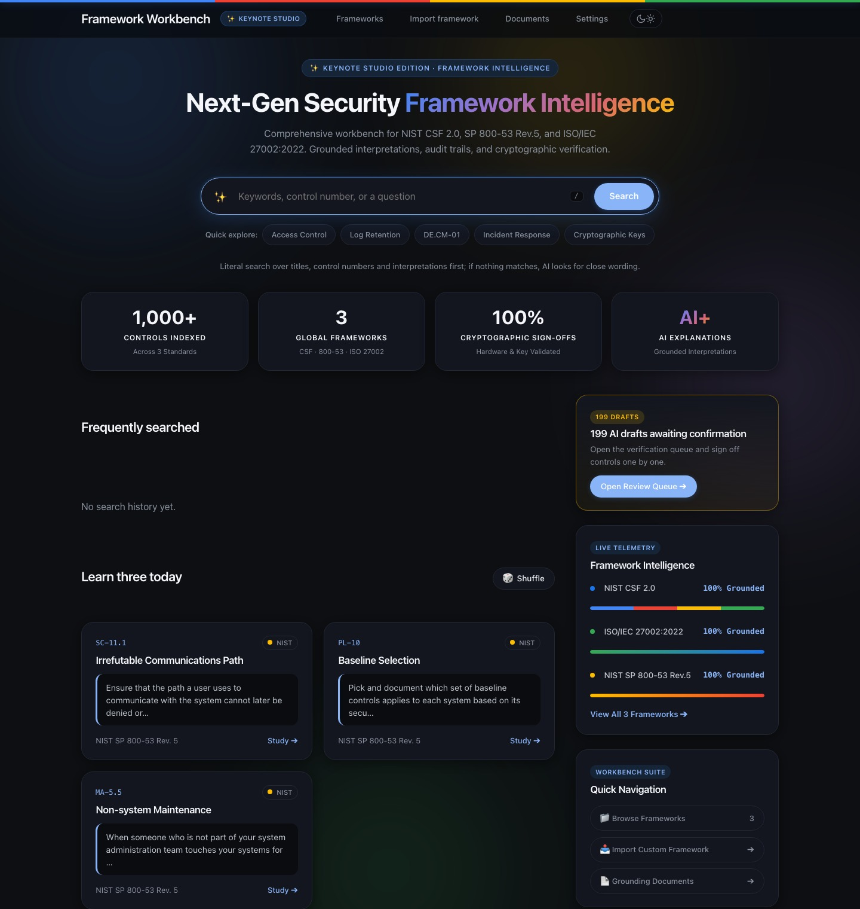
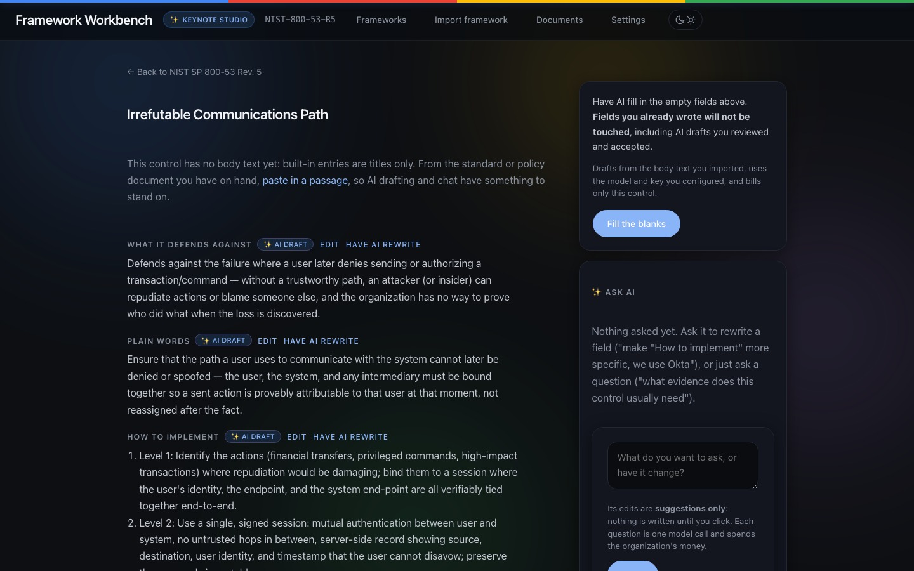

# Framework Reader

A workbench for NIST CSF 2.0, SP 800-53 Rev.5, and ISO/IEC 27002:2022:
look up a control, see what evidence usually looks like, what an auditor
asks next, and which official mappings exist.

ISO/IEC 27002 appears as **control numbers plus self-written labels** —
not the official standard text. NIST material is U.S. government work
(public domain). Interpretations currently ship as AI drafts, marked as
such; do not hand them to an auditor as-is.





## Why

Asking a model "which controls cover log retention?" gets a plausible
answer. What it does not get you:

- the evidence reviewers usually prepare for that control,
- the question an auditor asks next,
- the **official** CSF ↔ ISO mapping edges with their sources — inferred
  edges measured 17% accurate, so they are never auto-projected
  (main spec §7.3.3),
- a signature that records who confirmed an interpretation and voids
  itself the moment the text changes.

That gap is the product. The rest of this README is detail.

## Install

**From a clone** (what development uses):

```bash
python -m pip install -e ".[dev]"
make test
./scripts/fetch_sources.sh   # NIST public-domain sources into vendor/
make build                   # build/content.sqlite
fr serve                     # http://127.0.0.1:8765
```

**From the release assets** (no clone): download the wheel and the
prebuilt `content.sqlite` from the latest
[GitHub Release](https://github.com/pz1130/framework-reader/releases), then:

```bash
python -m pip install framework_reader-*.whl
export FR_CONTENT_DB=/path/to/content.sqlite
fr serve                     # -> http://127.0.0.1:8765
```

Docker (HTTP or HTTPS in front of the same process) is optional; see
**Optional Docker** below.

Copy `.env.example` to `.env` and fill in the vendor keys you actually use.
The content pack does not leave this machine; model calls use your key.

## Repository guide

- `docs/superpowers/` — the design specs, plans, and working notes this
  README keeps referencing (working documents, written in Chinese). Start
  at `specs/2026-08-19-framework-reader-design.md`; accounts / RBAC /
  Entra ID for the web service are designed in
  `specs/2026-08-23-hosted-service-rbac-aad-design.md`, which supersedes
  the main spec §7.3.5 "local deployment".
- `content/` — the YAML source of the content pack; `make build` compiles
  it into `content.sqlite`. Your own frameworks and interpretations never
  go here — they land in `~/.framework_reader_en/` (configurable via `$FRAMEWORK_READER_HOME`).
- `.claude/skills/framework-reader/` — a Claude Code Skill, so the CLI can
  be asked for from inside an editor session.
- `tests/` — includes a generated route × role authorization matrix that
  walks every web route as every role (`tests/web/test_authorization.py`).

## Development

```bash
make install     # install dependencies (incl. dev)
make check       # Ruff + focused type checks
make test        # run the test suite (no vendor/, no API key needed)
./scripts/fetch_sources.sh   # fetch NIST public-domain sources into vendor/
make build       # build build/content.sqlite (needs vendor/)
fr stats         # graph statistics
fr search log retention          # searches titles and interpretation bodies
fr show NIST-CSF-2.0:DE.CM-01   # the control, mapping edges, its interpretation
fr usage                        # self-usage log report (the only validation so far)
```

Asking inside Claude Code also works: `.claude/skills/framework-reader/`.

Supersession lives on the web: `/f/{framework}/supersession` - inherit an old
control's interpretation onto the new number in one click. Sign-offs do not
carry over; the new control must be confirmed again. Official supersession
edges for the built-in frameworks are already in the library.

## Running from any directory

In real use your cwd is wherever the document you are writing lives, not the
repo. Install a shim on your PATH:

```sh
cat > ~/.local/bin/fr <<'EOF'
#!/bin/sh
REPO="/your/path/Framework reader"
: "${FR_CONTENT_DB:=$REPO/build/content.sqlite}"
export FR_CONTENT_DB
exec "$REPO/.venv/bin/fr" "$@"
EOF
chmod +x ~/.local/bin/fr
```

`FR_CONTENT_DB` gives the content pack an absolute path - the default
`build/content.sqlite` is relative and points at nothing in other directories.
**This is not a convenience matter**: if the first real use stalls on "file not
found", the dead-reason log records "too annoying = the shim is broken" when the
shim was merely never installed. A setup problem masquerading as a product
conclusion is exactly the contamination the main spec §7.3.7 guards against.

Interpretation **drafts do ship in the content pack** (main spec §7.3.1
self-use downgrade), but `interpretation.state` ships with them, and `fr show`
prints `[AI draft, not confirmed by the author - state=draft]` before the body.
The build gate for signed interpretations did not loosen: they must be truly
signed, unchanged since signing, and glossary-clean.

## Validating that it earns its place (main spec §7.3.7)

The only validation question this tool has is **"what would you do without
it?"** — if eight times out of ten the answer is "I would just ask the model
directly", the core selling point does not hold. The protocol for answering
it honestly — separate the with-tool and without-tool answers once, save
both verbatim, then write one note on what the tool actually added — lives
in [docs/self-use-validation.md](docs/self-use-validation.md).

## Self-assessment and gaps (self-use)

```bash
fr assess --function DE          # record current state per control: 0=not done, 1/2/3=level, n=N/A
fr gap                           # gap report: weakest first, with next step and evidence
fr gap --out build/gap.md        # export
```

Self-assessment data lands in `$FRAMEWORK_READER_HOME/user.sqlite`
(default `~/.framework_reader_en/`), **not in `build/`** - `make clean` deletes all
of `build/`, and hours of human input must not go with it.

"What to do next" is a table lookup, not reasoning: at level 1, the next step is
`practice`'s level-2 text verbatim. CSF↔ISO is **never auto-projected**
(inferred edges scored 17% accuracy, see main spec §7.3.3).

Frameworks without interpretations, like ISO, switch to Statement of
Applicability mode (applicable? / implemented? / where is the evidence?):

```bash
fr assess --framework ISO-27002-2022 --function A.6   # by theme; A.5/A.6/A.7/A.8
fr soa --out build/soa.md                 # all 93 controls, unfilled ones marked TBD
fr soa --out build/soa.csv                # the extension decides the format
```

**Prompts appear only during entry and never leak into the exported SoA.**

## Accounts and login (web service S1-S3)

One organization, multiple users, permissions by role. **With zero accounts and
zero invites, the workbench requires no login** - local `fr serve` works as
before. The moment the first invite goes out, the door locks (not when the
invitee accepts - otherwise there is an open window in between).

```bash
fr account invite you@corp.example --role admin   # one-time link, printed once
fr account list                              # who holds which roles
fr account grant  someone@corp.example approver   # roles add up; no inheritance tree
fr account revoke someone@corp.example author     # revoking the last admin is refused
fr account disable someone@corp.example           # disable and kill their sessions now
fr account audit                             # who did what when
```

Four roles: `admin` (runs the system, **no confirm permission**), `author`
(imports and drafts), `approver` (signs off), `viewer` (read-only, the default
for new accounts). The person drafting and the person signing can be two people -
that is the core of the product, see design §1.3.

Identity data lands in `$FRAMEWORK_READER_HOME/identity.sqlite`, **separate from
the user database**: sessions write on every login, and mixing them makes
business writes fight session writes for locks; exported compliance material
should not carry password hashes along either. Session tokens and invite tokens
are **stored as hashes only**.

Permissions live on each route (`@needs(...)`), guarded uniformly, **unlabelled
routes are refused by default** - a missing label must fail in tests, never
silently pass. One test walks "every route × every role" and checks every cell
(`tests/web/test_authorization.py`): a permission matrix kept by hand will
drift from the code within three months.

Measured result for the four roles:

| | Confirm interpretations | Draft (costs money) | Edit fields | Export reports |
|---|:---:|:---:|:---:|:---:|
| `admin` | 403 | 403 | 403 | 200 |
| `author` | 403 | ✅ | ✅ | 200 |
| `approver` | ✅ | 403 | ✅ | 200 |
| `viewer` | 403 | 403 | 403 | 200 |

**The admin can edit no content** - to do that they grant themselves a role,
and that step lands in the audit log. Sign-offs record **the logged-in person**,
not the system account running the server.

**Granting yourself a role is refused by default** (design §4.3): another admin
must nod. A single-admin organization can switch that lock off on the members
page; both toggling directions land in the audit log. The CLI remains the
break-glass path. Only `grant` is blocked, not `revoke` - downgrading is not
privilege escalation.

Account management on the web: `/members` (members and roles, invites,
disabling), `/audit` (audit log). In a hosted deployment the admin may not have
a shell on the box - a management action possible in the CLI but not in the UI
effectively does not exist.

### Signing in with company accounts (Entra ID)

OIDC Authorization Code + PKCE, confidential client. Five environment
variables; `fr entra check` fetches the discovery document once and points at
the wrong one:

```bash
export FR_ENTRA_TENANT_ID=…      # your company's own tenant
export FR_ENTRA_CLIENT_ID=…
export FR_ENTRA_CLIENT_SECRET=…
export FR_ENTRA_REDIRECT_URI=https://your.domain/auth/entra/callback
fr entra check
```

Three things to verify in the Entra app registration: account type is
**single-tenant** (multi-tenant lets any Entra user reach your callback); the
App Roles' values are exactly `admin` / `author` / `approver` / `viewer`; the
enterprise app's "Assignment required" is on.

Roles **sync one way from Entra at login only** - manual tweaks on the members
page are overwritten at the person's next login. The single exception: the last
admin is never revoked - one missing role on the Entra side must not mean
nobody can run the system. The identity primary key is `oid`, not email: email
changes, and keying on it turns a rename into a new person.

**Configuring Entra locks the door**, even with zero accounts. When the redirect
URI is `https://`, the session cookie automatically gets `Secure`. Local
invite-based accounts stay - the first admin needs a way in, and you need a path
back when Entra is misconfigured.

## Models and keys (S4)

Admins configure "which role uses which vendor's model" and API keys on the
`/models` page. Keys are **stored encrypted**; the master key is
`FR_SECRET_KEY` (not in the database - in the database equals not encrypted):

```bash
fr secret new        # generate a master key, printed once
fr secret status     # is the master key set, which vendors have keys (last 4 chars only)
```

**Without a master key, keys are refused at write time**: silently storing
plaintext makes you believe it is encrypted when it is not. The page echoes only
`sk-…cdef`; the audit log records "configured deepseek", never a character of
the key. Missing entries fall back to environment variables, so local
deployment keeps working.

Drafting and rewriting share three gates: **per person per hour**, **per
organization per month**, and **concurrent jobs**. The ledger counts **controls,
not currency** - without live vendor pricing, converting to money is the
illusion of precision. The charge lands the moment the job starts (a job that
dies halfway still spent the money); refused requests are not charged.

## Documents (S5)

`/documents` takes your organization's own policies (`.docx` / `.txt` /
`.md`). When drafting **a framework you imported yourself**, the passages most
relevant to the control being drafted go to the model with it - otherwise the
drafter writes generic advice, while your real implementation lives in your own
files.

Retrieval intersects on character bigrams, no network, no new dependencies; too
small an intersection **returns nothing** - grounding in noise is worse than no
grounding, the model will invent a policy you do not have from irrelevant
passages. The documents page shows every extracted chunk: "what exactly did the
model see" must not be something only we know.

Two limits: no PDFs (the extracted paragraphs come out scrambled); **do not
upload purchased standard texts** - that is someone's copyright, and on our
server it becomes our problem. `viewer` cannot see documents; that tier exists
for external auditors.

## Local workbench

```bash
fr serve                      # -> http://127.0.0.1:8765
```

The web shell is built as an expressive **Keynote Studio Bento Grid UI**:

- **Keynote Studio Stage Aesthetic**: Full-bleed frosted glass navbar (`100vw`), signature 4-color glowing laser stripe (`#4285F4`, `#EA4335`, `#FBBC05`, `#34A853`), and smooth transition between **Obsidian Dark** and **Ceramic Light** modes.
- **Omnibox 2.0 & Keyboard Shortcut**: Floating search capsule with contextual prompt suggestions and an instant **`/` keyboard shortcut** to focus the search bar from anywhere on the page.
- **Asymmetric Bento Grid Dashboard**:
  - **Main Stage (Left)**: Hot-tracked security controls with quick jump tags, plus **Learn Three Today** floating study cards with framework badges, concise intent snippets, and an animated `🎲 Shuffle` button.
  - **Intelligence HUD (Right)**: **Live Telemetry** meters monitoring compliance coverage across NIST CSF 2.0, ISO/IEC 27002:2022, and NIST SP 800-53 Rev.5, an amber alert card for pending AI drafts, and quick-launch shortcuts to documents and frameworks.
- **Interactive Clause Chat**: Conversational AI assistant cards on control pages for context-aware Q&A, evidence brainstorming, and policy alignment.

Built-in and imported frameworks live under "Frameworks" in the top bar, with "has
interpretation N/M" coverage; you can also upload your own spreadsheet there.
Each framework has six pages: Controls, Supersession, Self-assessment, Gap
report, Remediation, Statement of Applicability (CSV download). Listens on
localhost only; data never leaves this machine.

**The gap report is not just a snapshot.** One click on "track these gaps"
files them into the **remediation ledger**: per control an owner, a due date,
and a state (To do / In progress / Done). The state is flipped by hand and is
deliberately not linked to self-assessment - "done" without a re-assessment is
just the owner's word. Re-assess and the gap report grows a **re-assessment
comparison** at the top (last time L1, this time L2).

**"Draft interpretations" sits in the framework page's top bar and under the
title**: imported and built-in frameworks alike can be drafted in one click.
Seven fields are drafted from the body text, in the background, with a progress
page refreshing every 3 seconds. It uses your own configured key (the vendor
`drafter` points at in `content/llm_providers.yaml`), one call per control.
Drafts are always marked "AI draft". For 800-53-scale frameworks (a thousand
plus controls) the top-bar button is sticky - no scrolling to the bottom.

```bash
fr migrate-drafts        # older accounts: move imported-framework interpretations
                         # from content/ into the user database
```

**For imported frameworks, you can edit the interpretations yourself.** Each
field on the control page has an "Edit"; a field you edit is recorded as
`practitioner` (yours) and stops being marked "AI draft" - the marking is
per-field, so one page shows which sentences came from the model and which are
your own words. Controls the model never touched can be written entirely by you.

**Humans and AI can write together.** Three routes, provenance always clear:

- **Fill blanks only**: "Fill the blanks" at the bottom of a control page drafts
  only the empty fields and **never touches a field you already wrote**
  (including AI drafts you have read and accepted). Only that control is charged.
- **Let AI rewrite**: give a one-line instruction next to the field ("be more
  specific, name the systems") and the model rewrites accordingly. The output is
  still marked "AI draft" - **the request was yours, the words are the model's**.
- **Your confirmed controls as examples**: controls in the same framework that
  you have **confirmed** enter the prompt as few-shot examples, so the model
  learns your company's tone and granularity. Unconfirmed ones do not count -
  those may themselves be model output, and using them as examples is the model
  learning from itself.

When done, "I confirm this control" records the signer (the local username),
the time, and a digest of the content as it was signed. **Any later change
voids the signature** (W2 spec §4.3: a signature counts only while unchanged).
The "Confirmed" column on the framework page is the single indicator of whether
that framework can be handed over.

Built-in frameworks (CSF / 800-53 / ISO) can also be drafted from the web: the
result lands in your user database as a working copy, overlaid on the content
pack, **never in git**. To write into the content pack (for publishing) use
`fr draft --framework-id NIST-800-53-R5`.

`fr interview` (the author's three-question sign-off tool) does not accept
imported frameworks: it writes `content/interpretations/`. The
`InterpretationStore.save()` gate blocks any attempt to write user frameworks
into the content repository, whatever the caller is.

Interpretations of imported frameworks land in
`$FRAMEWORK_READER_HOME/user.sqlite`, **not in `content/`** - that is what we
publish, it goes into git, and `make build` bakes it into the content pack.
Your company's policy interpretations do not belong there.

## Optional Docker

The default path is still `fr serve` on the host. Docker is extra: same
process, HTTP inside the container. TLS is terminated by Caddy in front,
not by uvicorn.

```bash
# First set FR_BOOTSTRAP_ADMIN_PASSWORD in .env.
# HTTP on http://127.0.0.1:8765  (set FR_HTTP_BIND=0.0.0.0 to listen on the LAN)
docker compose up --build

# HTTPS on https://localhost/  (Caddy; browser warning on the internal CA)
# For a public hostname: FR_SITE_ADDRESS=framework.example.com and open 80/443
docker compose -f docker-compose.yml -f deploy/compose.https.yml up --build
```

Before the first start, set a strong `FR_BOOTSTRAP_ADMIN_PASSWORD` in `.env`;
Compose refuses to start without it. `FR_BOOTSTRAP_ADMIN_EMAIL` defaults to
`admin@localhost`. The first account holds admin + author + approver so a solo
deploy can actually use the workbench; after it exists, the door locks.

User data lives in the `fr-data` volume (`FRAMEWORK_READER_HOME` and a copy of
the content pack). `FR_SECRET_KEY` comes from the environment; if you omit it,
the entrypoint generates one onto the volume so restarts keep decrypting
stored API keys. In production inject the key from a secrets manager.

Existing certificates: put `cert.pem` and `key.pem` in `deploy/certs/` (not
committed) and set `FR_CADDYFILE=./deploy/Caddyfile.certs`. Entra's redirect
URI must be `https://<host>/auth/entra/callback` so session cookies get
`Secure`.

## Importing your own framework

```bash
fr import my.csv --id ACME-SEC-2026 --name "ACME Information Security Policy"
fr frameworks                       # built-in and imported, listed together
fr draft --framework-id ACME-SEC-2026 --full   # draft with your own key
fr assess --framework ACME-SEC-2026            # self-assessment and gap report as usual
```

Required columns: "ID" and "Title"; optional: "Parent" and "Body". **"Body"
decides draft quality** - drafting from titles alone produces guesses; with your
own policy text the interpretation is grounded in your actual requirements.

Imported frameworks go into `~/.framework_reader_en/user.sqlite`, **never into the
content pack**, and we never distribute them.

## Publishing (content first)

```bash
fr publish                       # -> build/site/index.html, self-contained page
```

106 interpretations + 737 official mappings. The header states the provenance
(AI-drafted, not confirmed per control) and the copyright boundary (no
copyrighted source text is reproduced). **Only exportable mapping edges are
rendered**; inferred edges are excluded, every one.

## Interpretation production (W2)

```bash
fr llm check                 # ping each vendor preset (sends real requests; run manually)
fr golden validate           # validate the 3 handwritten golden samples
fr draft --all               # batch-draft the four non-differentiating fields (concurrent, offline)
fr interview --next          # interview the next control: three questions -> extract -> sign in $EDITOR
fr golden diff               # interview output vs handwritten golden sample
fr lint calibrate            # calibrate the extraction-fidelity threshold
```

## Blind test (W3)

```bash
fr blindtest prepare --seed 42        # stratified sample of 10, builds the packet; send packet.md
                                      # to judges, never answer_key.json
fr blindtest tally --seed 42 --judge Wang --picks "1=A,2=C,…" --note "the probe questions helped"
fr blindtest report --seed 42         # conclusions, with pass-line verdict and wording limits
fr blindtest repacket --seed 42       # re-render the questionnaire only; no resample, no model calls
```

A judge may mark a control `3=none useful`. Force a three-way choice and the
product still wins 70% when all three are garbage - that 70% measures nothing.
Such votes **count in the denominator and for no packet** (abstentions do not
inflate the product's score), and are excluded from the pairwise comparison
(product vs bare LLM).

`repacket` re-renders from `variants.json` and asserts the variant mapping still
matches `answer_key.json` - on mismatch it refuses to produce anything. Once the
letters in a judge's hands change, every already-returned verdict is void.

`answer_key.json` records the **sampling-frame fingerprint**: a seed alone does
not guarantee reproduction - the same seed over a different frame draws a
different set. If `prepare` finds a fingerprint mismatch it stops and says so;
it never quietly swaps the question set.
